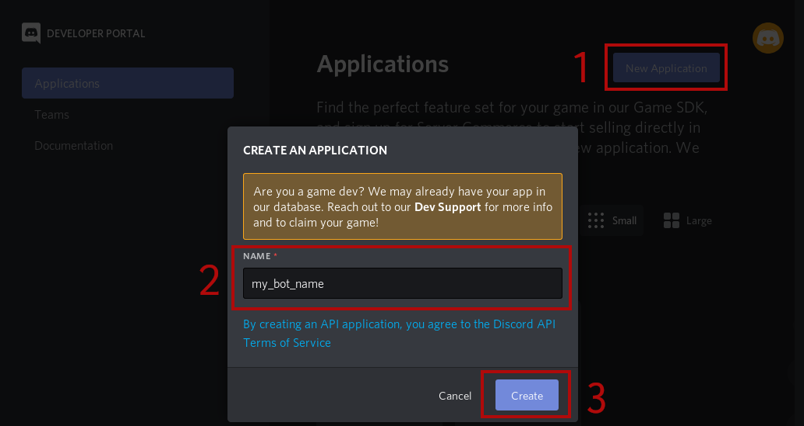
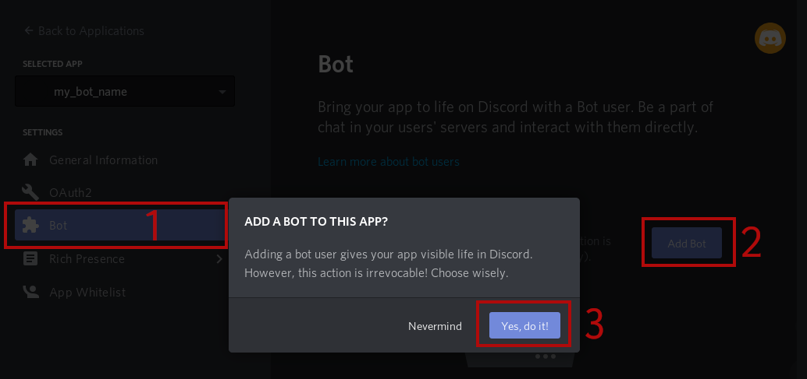
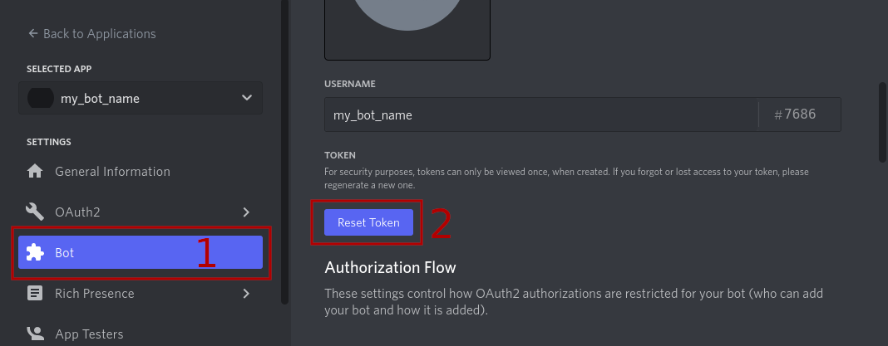
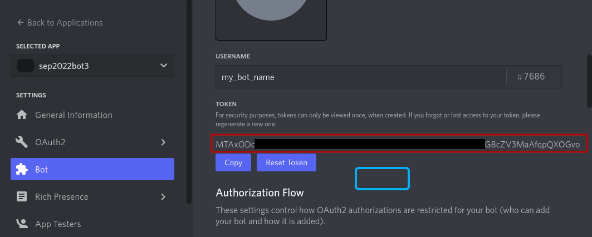
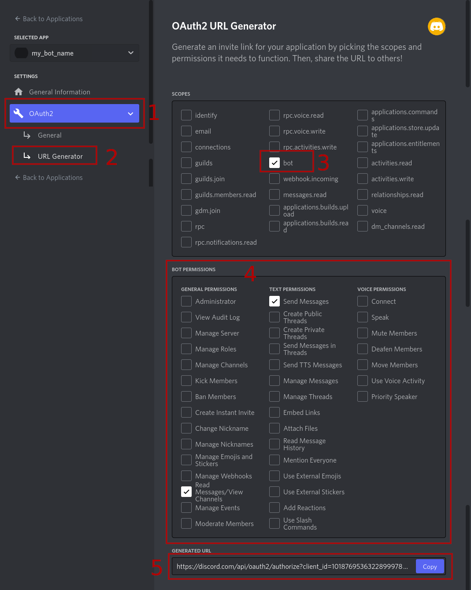
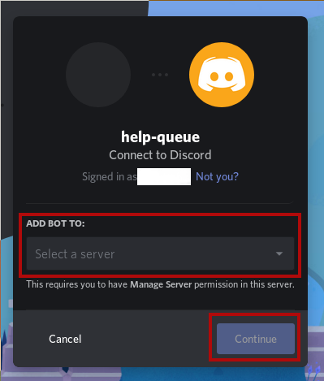

# Template for a Python Discord Bot: 
A simple template or startingpoint for Discord bot 
which uses [discord.py](https://discordpy.readthedocs.io/en/latest/index.html)
to interact with Discord services.


# Quickstart
1. Clone the repo.

2. Create a copy of `.env.template` for configuration:
```
cp .env.template .env
```

3. Create an application with a bot at
<https://discordapp.com/developers/applications>,

4. Add your bot's token to your `.env` file:
```
DISCORD_TOKEN=<your-token-here>
```

5. Generate an OAuth2 invite-URL and use it to invite the bot to your server
(<https://discordapp.com/developers/applications> >>  [your application] >> [OAuth2] >> [URL Generator])

The bot needs the following permissions:
* `Send Messages`


6. Start the bot `python bot.py`


# Installation 

## Clone the repo
```
git clone https://github.com/jonascj/python-discord-bot-template.git
```

or download files in some other manner from the repo.

## Install dependencies 
```
pip install -r reqs.txt
```
or
```
pip install discord.py python-dotenv
```
## Create an `.env` file for configuration
Make a copy of `.env.template` called `.env`:
```
cp .env.template .env
```
This is the configuration for the bot

## Create a Discord application 
Go to <https://discordapp.com/developers/applications>,
login with an discordapp.com user
and follow the steps as indicated in the screenshot below:


## Add a bot to the application


## Bot token
Obtain your bots security token and place it in your local `.env` file:
```
DISCORD_TOKEN=<your-token-here>
```

**Important!** Keep this token secret.
Anyone who knows the token can impersonate your bot/application
with the consequences falling back on your account
(since Discord will think it is you, with _your_ token).

1. Reset your bot's token to obtain a new one. 
   The original one created (upon bot creation) is not visible to me (bug in discord.com user interface?).
   

2. Copy the token displayed (either manually or using the [Copy] button). 
   

If you misplace your token you can not view it again, 
you will have to create a new again.

If you create a new token again (by pressing [Reset Token]) 
your bot will not be able to run (join servers/guilds) before
you update your `.env` file with the new token.


## OAuth2 URL
Obtain an OAuth2 URL used to invite your bot to a server / guild.

Follow the steps as indicated in the screenshot below: 


In step 4 you need to select the following permissions: 
* `Send Messages`
* `Read Messages/View Channels`

## Invite your bot to your server/guild
1. Visit the copied OAuth2 URL (`https://discordapp.com/api/oauth2/auth...`)
in your browser.

2. Login the user account used to create your guild/server
and select the server you wish to add the bot to.

If you login as a user which has created no servers
and does not have *Manage Server* permission on any other servers
the *Select a server* dropdown menu will be empty.




## Start the bot
Finally start the Python bot:
```
python bot.py
```

You should now see your bot join your server.  
Test it by sending a message `!hello` or `!yo`.

The bot is only connected to the server as long as
this Python process is running.
To have a permanent persence on your discord server
the bot should be run on a machine which is always on.


